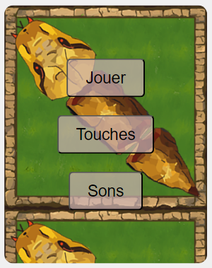
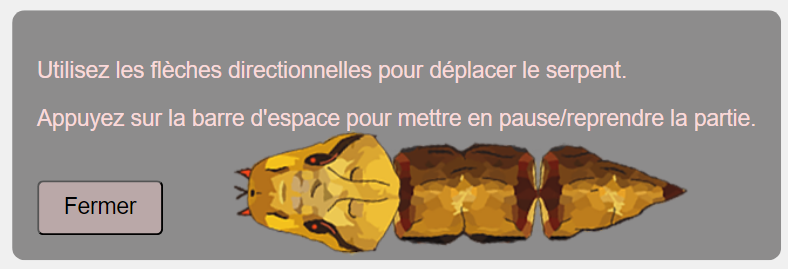

# 🐍 Snake Game

Un jeu classique de **Snake**, développé en JavaScript, HTML et CSS. Le but est simple : mangez les pommes pour grandir tout en évitant de vous heurter aux murs ou à votre propre corps.

---

## 🎮 Fonctionnalités

- Contrôles simples pour diriger le serpent.
- Augmentation progressive de la vitesse à mesure que le score augmente.
- Système de score pour suivre vos performances.
- Rejouabilité infinie !

---

## 🚀 Comment jouer

1. Lancez le jeu dans un navigateur.
2. Utilisez les touches de direction pour contrôler le serpent :
   - `↑` Flèche haut
   - `↓` Flèche bas
   - `←` Flèche gauche
   - `→` Flèche droite
   - `barre espace` Mettre sur pause & controler le volume du son.
   - `esc` Pour revenir au menu
3. Mangez les pommes.
4. Évitez de heurter :
   - Les murs.
   - Votre propre corps.
5. Continuez jusqu'à ce que vous perdiez, puis essayez de battre votre record !
 
---

## 🛠️ Installation et exécution

### Pré-requis
- Un navigateur moderne (Google Chrome, Firefox, Edge, etc.).
- Un serveur local (facultatif, recommandé pour éviter des problèmes de chemins relatifs).

### Instructions
1. Clonez ce dépôt sur votre machine locale :
   ```bash
   git clone https://github.com/Nora-H01/snake.git

2. Naviguez dans le dossier du projet jusqu'au fichier :
   index.html

3. Ouvrez le fichier index.html dans un navigateur, ou utilisez un serveur local (par exemple, via Live Server dans Visual Studio Code).


## 🎨 Aperçu
   